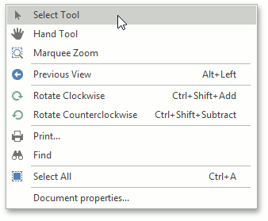
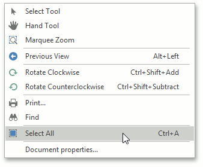

# Select and Copy the Document Content
The PDF Viewer provides for selecting and copying text from the selectable document to the clipboard. Note that only plain text copying is supported.

To enable the selection mode, invoke the context menu and choose the **Select Tool** item. This mode is active by default.

To copy the viewing document content, select the required text, right-click the selected text and select the **Copy** command in the context menu, or press **Ctrl**+**C**.

To select all the text in a document for copying, invoke the context menu and choose the **Select All**  command, or press **Ctrl**+**A**.

