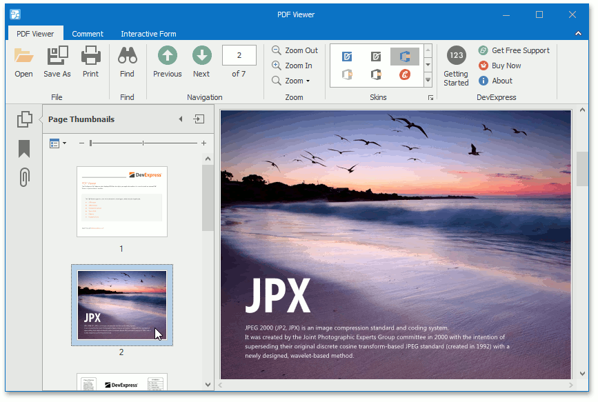
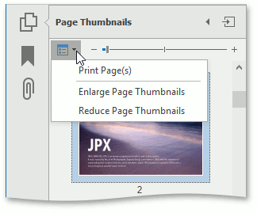
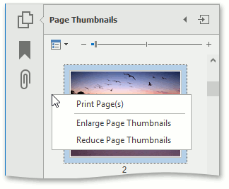
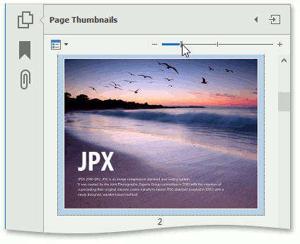

# Thumbnails
This document introduces page thumbnails and describes their capabilities on a Navigation pane.

This document consists of the following sections.
* [Overview](#overview)
* [Customization](#customization)

## <a name="overview"/>Overview
A thumbnail provides a miniature preview of a document page. The PDF Viewer shows page thumbnails of an active PDF document in the **Page Thumbnails** panel. The panel is located on the **Navigation** pane.

When a thumbnail is selected, the PDF Viewer shows the corresponding page.

You can navigate through a document by selecting the page thumbnails.

The **Page Thumbnails** panel provides thumbnail options that can be accessed using one of the following ways:
* click the **Options** drop-down button;
	
	
* use the right click menu of the **Page Thumbnails** panel.
	
	

## <a name="customization"/>Customization
The **Page Thumbnails** panel provides the following options.
* **Print Pages...** -   invokes the **Print** dialog in which you can print pages that correspond to the selected thumbnails.
	
	Use this option after a thumbnail is selected. If there are no selected thumbnails in the panel, the **Page range** option in the **Print** dialog is set to **All**. This means that all pages in a document can be printed.
* **Enlarge Page Thumbnails** - increases the page thumbnails size.
* **Reduce Page Thumbnails** - decreases the page thumbnails size.

You can also enlarge/reduce thumbnail size using one of the following ways:
* press **Ctrl** on the keyboard and scroll the mouse wheel when the **Page Thumbnails** panel is focused;
* use the zoom slider which is placed on the **Page Thumbnails panel**.
	
	