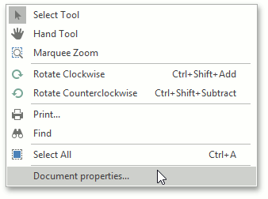
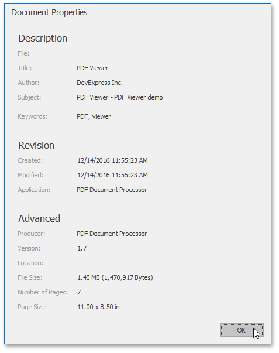

# View Document Properties
To view information related to the currently opened document, invoke the context menu by right-clicking this document and selecting **Document properties...** item.

The dialog displaying the standard set of the PDF file properties is invoked.

