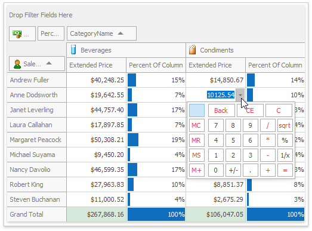
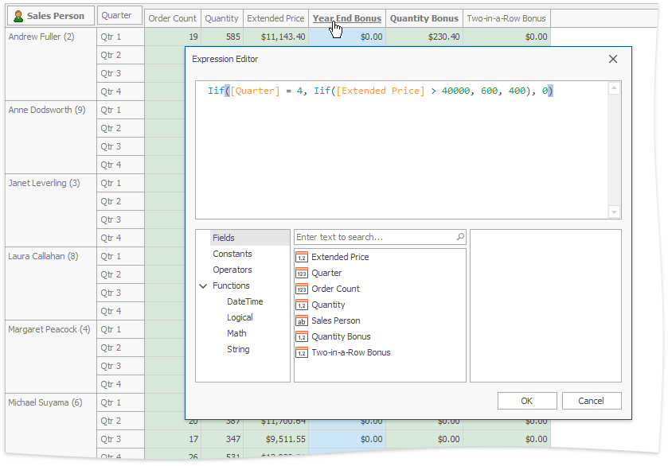

# Edit Data in Pivot Tables
## Edit Cell Values
To edit a cell value, click the cell and specify a new value:

Cell values are specified via editors of different types (e.g. text editor, calculator, etc.), depending on the cell data type and pivot table settings.

## Edit Expressions
Specific columns allow you to set a regular or Boolean expression which will be used to calculate their values. Clicking the column header invokes the Expression Editor used to specify the expression:

To learn more about using the Expression Editor, see [Expression Editor](../../expression-editor.md).