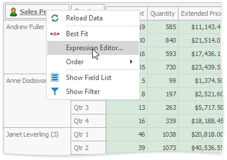

# Edit Unbound Expression
You can edit the unbound field's expression in the Expression Editor by selecting the **Expression Editor...** menu command. Expressions allow you to calculate values based on values of other fields. You can use constants, various functions and operators in expressions.

