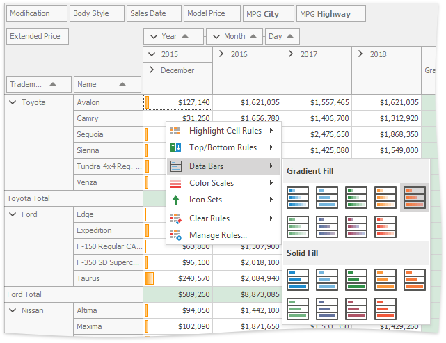
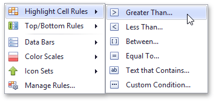
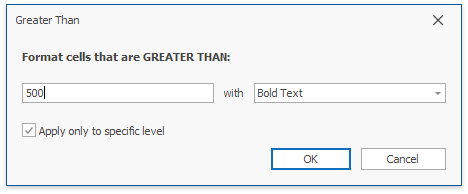
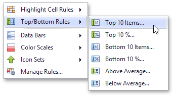
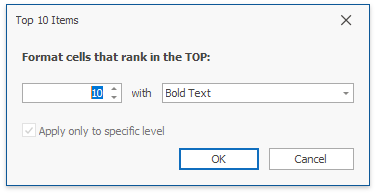
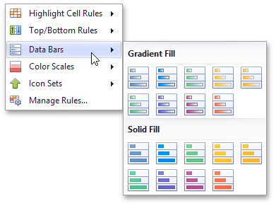
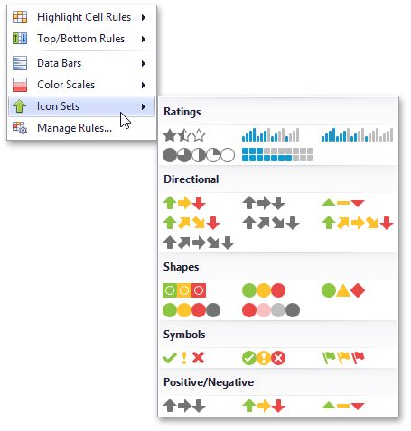
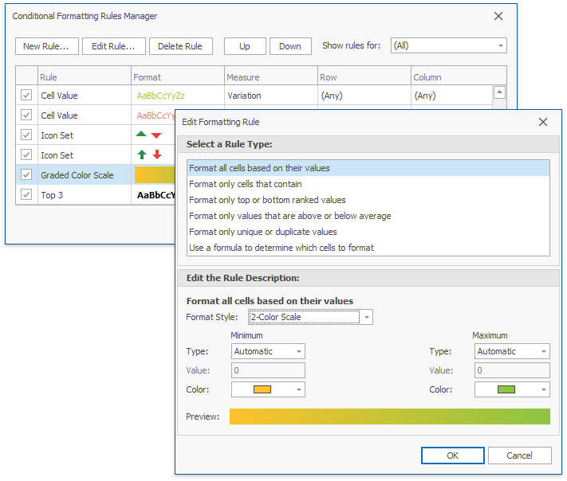
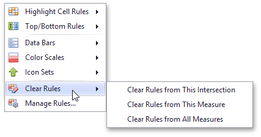

# Apply Conditional Formatting
You can change the appearance of individual cells based on specific conditions using **Format Rules** context menu. This feature helps to highlight important information, identify trends and exceptions, and compare data.

To invoke the menu, do the following.
* Right-click the data cell corresponding to the intersection of the required data, row and column field.
* Select the required rule from the list.

Available format rules are displayed when expanding the **Format Rules** menu.

## Highlighting Cells that Meet a Specific Condition
This rule formats cells if values matches one of the predefined conditions, custom condition or contain the specified text.

To apply this format, do the following:
* Choose the **Highlight Cell Rules** menu item and select the rule type.
	
	
* According to the selected rule type, an appropriate dialog window is invoked.
	
	
	
	Specify the rule value(s), choose a format style in the dropdown list, and click the OK button. To apply formatting to all data cells instead of an intersection, clear the **Apply only to specific level** check box.

## Highlighting Top or Bottom Cell Values
This rule formats cells that contain the highest or lowest values, and values that are above or below the average of the field intersection data cells value.

To apply this format, do the following:
* Choose the **Top/Bottom Rules** menu item and select the rule type.
	
	
* According to the selected rule type, an appropriate dialog window is invoked.
	
	
	
	Specify the rule value if it is necessary, choose a format style in the dropdown list, and click the OK button.

## Highlighting Cells Using Data Bars
A data bar fills a cell according to the ratio of the cell's value to the highest and smallest field intersection data cells values. A longer bar corresponds to a higher value, and a shorter bar, to a lower value.

To apply this format, choose the **Data Bars** menu item and select the bar style format.

Solid bars and bars with gradient fills are available in various colors.

## Applying Color Scales
This format shows data distribution and variation using color scales. A cell is filled with a background color that is calculated according to the ratio of the cell's value to the highest and smallest field intersection data cells values.

To apply this format, choose the **Color Scales** menu item and select one of the predefined two or three-color scales.

## Highlighting Cells Using Predefined Icons
Icon sets allow you to classify data cells values into three, four or five ranges separated by threshold values, and display a specific icon in a cell according to the range to which this cell value belongs. In the Positive/Negative group, the available icon sets divide column values into three ranges: positive values, negative values and values equal to zero.

To apply this format, choose the **Icon Sets** menu item and select one of the predefined icon sets.

## <a name="manager"/>Conditional Formatting Rules Manager
You can create, sort and modify the created rules using the **Conditional Formatting Rules Manager**. To invoke this manager, select the **Manage Rules...** item from the Format Rules context menu.

* To **create** a new rule, click the **New Rule...** button, select a rule type and specify its parameters. Depending on rule type, you can set maximum and minimum values, specify format, colors or icon style, etc.
* To **edit** the existing rule, click the **Edit Rule...** button and change the rule parameters. Besides that, you can see the rule's format preview and specify row, measure and column in the list of rules in the main window.
* To **delete** the rule, select the rule and click the **Delete Rule** button.
* To **reorder** rules, select the rule and click **Up** or **Down** button.

## Deleting Rules
If you have already applied one or more rules to data cells, the additional **Clear Rules** item is displayed in the **Conditional Formatting** menu.

You can select one of the following items.
* Click the **Clear Rules from This Intersection** menu item to delete conditional formatting rules from the target fields intersection.
* Click the **Clear Rules from This Measure** menu item to delete conditional formatting rules from the target data field.
* Click the **Clear Rules from All Measures** menu item to delete formatting rules from all data cells.