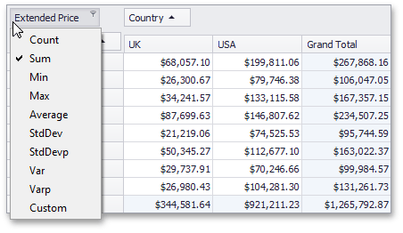

# Change Summary Type in Pivot Tables
Pivot Tables can perform different calculations against data (for instance, calculating sums, averages, maximum and minimum values, etc.).

To specify which calculations Pivot Table should do against its data, left-click a data header and choose the appropriate function type.

