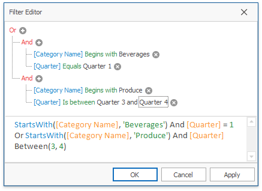
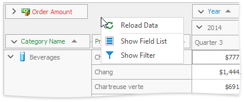
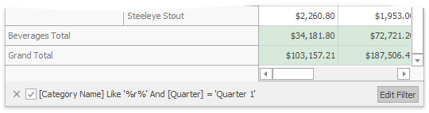

# Build Complex Filter Criteria
To build complex filter criteria consisting of multiple filter clauses using various filter operators, you can use a Prefilter (Filter Editor):

The Prefilter does not affect filtering via Filter Popup Windows.

To invoke a Prefilter, click an empty space within the Pivot Table header region and select **Show Prefilter** from the context menu.

After you have built and applied a filter condition, a prefilter panel appears at the Pivot Table bottom. This panel displays the filter condition.

To modify a filter condition, open a Prefilter. You can now do it by clicking the **Edit Prefilter** button.

To temporarily disable filtering, uncheck the  button.

To remove filtering, click the  button.

For information on the Prefilter filtering capabilities, see [Filter Data via the Filter Editor](../../../filter-editor/filter-data-via-the-filter-editor.md). To learn how to create filter criteria using a Prefilter, please see [Examples of Using the Filter Editor](../../../filter-editor/examples-of-using-the-filter-editor.md).