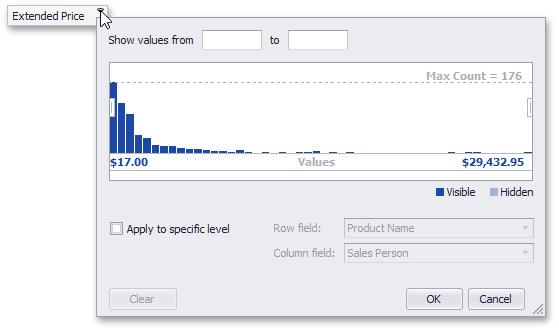

# Invoke a Summary Filter Window
To enable and configure filtering by cell values, use the Summary Filter Window.

You can invoke a Summary Filter Window from the Pivot Table or from a Field List (to learn about Field Lists, see [Field List Overview](../../../../../../interface-elements-for-desktop/articles/pivot-table/field-list-overview.md)).

## Invoke a Summary Filter Window from the Pivot Table
Field headers located in the Data Area display special buttons used to invoke a Summary Filter Window. Follow the steps below.
1. Hover over the header of a field whose data you need to filter. A filter button () will be highlighted.
	
	
2. Click this filter button to display a Summary Filter Window.
	
	

## Invoke a Summary Filter Window from a Field List
You can use an advanced Field List to filter field values.

First, invoke a Field List. For information on how to do this, see [Invoke a Field List](../../../../../../interface-elements-for-desktop/articles/pivot-table/field-list/invoke-a-field-list.md).

To open a Summary Filter Window, click the filter button displayed in the field header.

