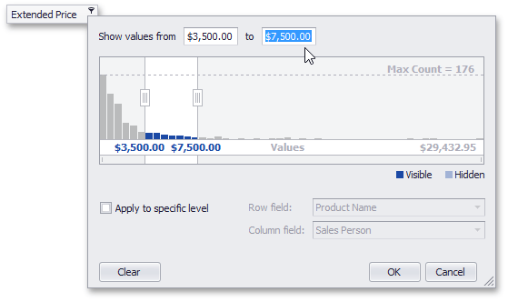
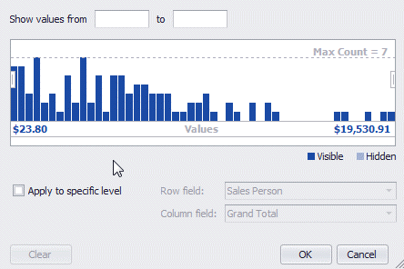

# Select a Range of Values
You can select a range of cell values to be displayed in any of the following ways.
* Enter the bounds of the range into the appropriate text editors.
	
	
* Drag selection thumbs in the range selector.
	
	
* If a range is already selected, you can select a different range with the mouse.
	
	