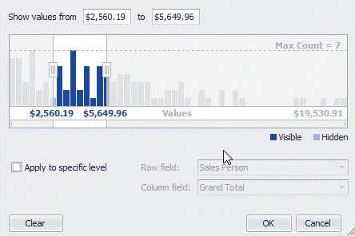

# Zoom and Move the Viewport
## Zoom
You can zoom in or out by shrinking or enlarging a viewport scroll thumb displayed within the Zoom &amp; Scroll Bar.

To zoom in, drag a zoom grip inwards. To zoom out, drag a zoom grip outwards.

## Move Viewport
To move the viewport, drag a viewport scroll thumb.

