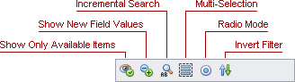

# Filtering Options
The Pivot Table allows you to customize its filtering mechanism according to your needs.

If the corresponding functionality is enabled by your application vendor, Filter Windows display toolbars where you can access various filtering options.

Use the toolbar buttons to enable or disable particular options.

The following table describes the available toolbar buttons.

| Icon | Button Tooltip | Description |
|---|---|---|
|  | **Show Only Available Items** | If this button is pressed, values that cannot be displayed because of filtering applied to other fields are hidden from Filter Windows. Note that this button is not available for [Hierarchical Filter Windows](using-filter-popup-windows.md). |
|  | **Show New Field Values** | If this button is pressed, field values that have appeared in the database after the field's filtering was configured are shown by default. If this button is released, new field values are hidden by default. To view these values, check them manually in the corresponding Filter Window. |
|  | **Incremental Search** | If this button is pressed, the Incremental Search feature is enabled. This feature allows you to locate a value in the Filter Window by typing its initial characters. |
|  | **Multi-Selection** | If this button is pressed, you can select multiple values by sequentially clicking them with the CTRL key held down (or the SHIFT key to select a continuous range of values). In this instance, a field value is selected when you click its name, and checked (or unchecked) when you click a corresponding check box. When you click a check box with multiple values selected, this changes the checked state of all selected values. If this button is released, you cannot select multiple values. In this instance, a field value is selected and checked (or unchecked) when you click either its name or a corresponding check box. |
|  | **Radio Mode** | If this button is pressed, Filter Windows hide check boxes and display field values in a simple list. In this instance, you can select and view only one value from each field in the Pivot Table. |
|  | **Invert Filter** | Inverts the checked state for all values. |