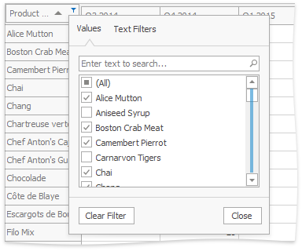

# Using Filter Windows
Depending on the settings made by your application vendor, the Pivot Table can display an individual Filter Window for each field, or an integrated Filter Window for a group of fields.

This topic describes how to filter data using both types of Filter Windows.

## Excel-style Filter Window
The Excel-style filter popup's content depends on the type of data the related field displays. 

In the **"Values"** tab, end-users can select specific field values from the Pivot Grid. 

The **"Filters"** tab supplies users with additional options related to the field type. For example, when filtering a string field, you can show only those records that begin with 'C': 

Filters applied using the Excel-style filter popup are displayed in the Filter Panel and can be changed in the Filter Editor dialog, which allows end-users to apply complex filter conditions.

> The Excel-style filter cannot be used to apply filtering in OLAP mode. 

## Simple Filter Window
A simple Filter Window allows you to hide visible and show previously hidden values of a particular field.

In the Filter Window, uncheck field values that should be hidden and check values that should be visible. Then, click **OK** to close the window and apply the filtering.

Note that you can customize Filter Window settings using the toolbar displayed at the top of the window. To learn how to do this, see [Filtering Options](filtering-options.md).

## Hierarchical Filter Window
A hierarchical Filter Window displays values of several fields, arranged in a tree-like manner.

In the Filter Window, uncheck field values that should be hidden and check values that should be visible.

Use the  buttons to expand field values and access their child values. To collapse an expanded field value and hide its child values, use the  button.

You can also expand and collapse all values on a particular level. To do this, right-click any field value and select **Collapse All** or **Expand All** from the context menu.

For instance, to expand all quarters and display months, right-click any quarter value and select **Expand All** from the context menu as shown on the image below.

Click **OK** to close the window and apply the filtering.

Note that you can customize Filter Window settings using the toolbar displayed at the top of the window. To learn how to do this, see [Filtering Options](filtering-options.md).

## Filtering Indication
You can determine whether a field is filtered by looking at its header. Filter buttons for these fields are visible even when you are not hovering over their headers.

## Removing Filtering
To remove filtering against a specific field, invoke its Filter Window and select **(Show All)**.