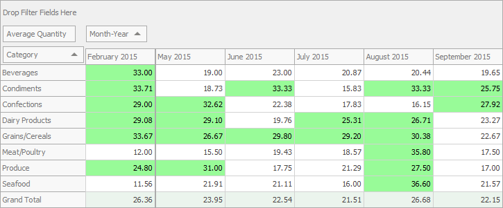
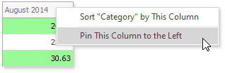

# Pinned (Fixed) Columns

The Pivot Grid Control allows you to pin columns to the left or rightmost edge. The pinned columns are never scrolled horizontally, so you can use them as a reference point for adjacent cell values. 

 

 To pin or unpin a column, right-click the column header and select the corresponding command:

   

