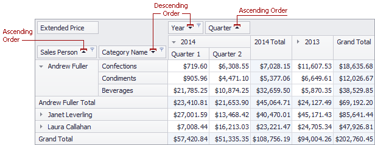
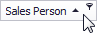

# Simple Sorting
Values of dimension fields are always arranged in ascending or descending order. The sort order is indicated by an Up or Down arrow displayed within a corresponding dimension field's header.

To toggle the sort order for a dimension field, click this field's header.

You can also sort field values using a Field List or context menu. To learn more, see [Sort Data Using a Field List](sort-data-using-a-field-list.md) and [Sort Data Using the Context Menu](sort-data-using-the-context-menu.md).