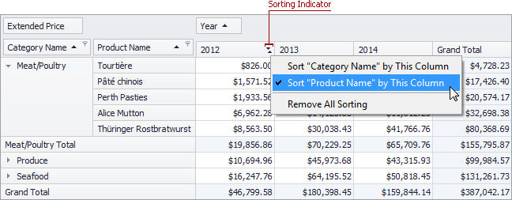

# Sort Data by Summaries
You can sort values of a particular dimension field by summary values calculated against a specific data field. To do this, right-click a column or row header, and choose a dimension field whose values should be sorted by column/row summary values. A specific indicator marks the column/row whose summary values are used to define the sort order.

You can sort values of multiple dimension fields against a single column/row. To cancel this sorting, click the same item again, or 'Remove All Sorting' to cancel sorting for all dimension fields.