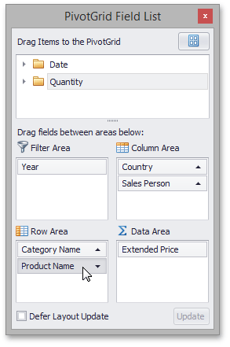

# Sort Data Using a Field List
You can use an advanced Field List to sort field values (to learn more about Field Lists, see [Field List Overview](../../field-list-overview.md)).

First, invoke a Field List. For information on how to do this, see [Invoke a Field List](../../field-list/invoke-a-field-list.md).

To toggle the sort order of a field, click its header.

You can sort data without using a Field List. To learn more, see [Simple Sorting](simple-sorting.md) and [Sort Data Using the Context Menu](sort-data-using-the-context-menu.md).