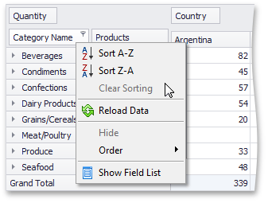

# Sort Data Using the Context Menu
Depending on the Pivot Table settings made by your application vendor, you may be able to sort data using the context menu.

If the corresponding functionality is enabled, the context menu invoked when you right-click a field header contains the **Sort A-Z**, **Sort Z-A** and **Clear Sorting** items.

Select **Sort A-Z** to set ascending sort order, and **Sort Z-A** to set descending order.

To reset sort order to the default one, select **Clear Sorting**.