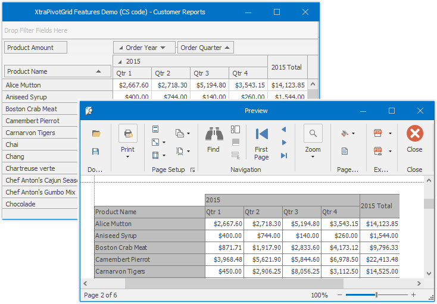

# Exporting and Printing

The Pivot Grid control allows its data to be printed and exported.

## Export

The [Pivot Grid](../../pivot-table.md) control allows you to export Pivot Grid data to a file or stream in various formats - HTML, MHT, PDF, RTF, TXT, CSV, XLS or XLSX. When you export, you copy data from a pivot grid into a new file formatted for use in another application. 

 

 ### Export Modes

Two export modes are supported when exporting data from a Pivot Grid control to table formats (*.xls(x), *.csv).

* **Data-aware Export** - The export mode, optimized for subsequent analysis of pivot grid data within Microsoft Excel. Various data shaping options that are applied within the pivot grid are retained in the output XLS(X) and CSV documents.

* **WYSIWYG Export** - In this export mode, the layout of pivot grid cells is retained in resulting XLS(X) and CSV documents. Specific data shaping options are not retained compared to data-aware export.
Data exported using other formats (PDF, RTF, TXT, etc.) is always exported in the WYSIWYG mode.

### Data-Aware Export

Data-aware is the default export mode for XLS and XLSX formats, and is optimized for subsequent analysis of pivot grid data within Microsoft Excel.

The following data shaping options, which are applied within the pivot grid control, are retained in the output XLS-XLSX documents.

* Data Grouping - with the capability to collapse/expand groups within a worksheet.
* Fixed Columns – allow column and row areas to stay in sight.
* Cell Formatting – allows you to export the number format.
* Display Text/Value export - allows you to select whether to export display text or values.

## Printing

The Pivot Grid Control allows to print its data by the [Print Preview](../../print-preview/print-preview-for-winforms.md) form.

 

