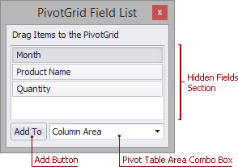

# Field List Overview
Pivot Table provides a Field List form used to reorder and hide fields, sort and filter data, etc. For more information on how to invoke a Field List, see [Invoke a Field List](field-list/invoke-a-field-list.md).

This topic describes Field List visual elements and layout.

Depending on Pivot Table settings made by your application vendor, Pivot Table can display either a simple or advanced Field List.

## Simple Field List
The following picture shows a simple Field List.

A simple Field List contains the following visual elements:
* **Hidden Fields Section** - contains headers of fields hidden from Pivot Table. Use it to display hidden fields.
* **Add Button** - used to display a selected field in a specified Pivot Table area.
* **Pivot Table Area Combo Box** - used to choose a Pivot Table area where the selected field will be displayed after you click the **Add** button.

Use a simple Field List to hide fields from Pivot Table and display hidden fields again.

For more information on operations available in a simple Field List, refer to the following topics:
* [Hide Fields Using a Field List](layout-customization/hide-fields/hide-fields-using-a-field-list.md)
* [Display Hidden Pivot Table Fields](layout-customization/display-hidden-pivot-table-fields.md)

## Advanced Field List
The following picture shows an advanced Field List.

An advanced Field List contains the following visual elements:
* **Hidden Fields Section** - contains headers of fields hidden from Pivot Table. Use it to display hidden fields.
* **Filter, Column, Row and Data Area Sections** - contains headers located in respective Pivot Table areas.
* **Defer Updates Check Box** - used to enable/disable automatic Pivot Table updates (see [Defer Pivot Table Updates](field-list/defer-pivot-table-updates.md)).
* **Update Button** - used to force Pivot Table to update (see [Defer Pivot Table Updates](field-list/defer-pivot-table-updates.md)).
* **Layout Button** - used to invoke the _Layout_ menu and change the Field List layout (see [Change Field List Layout](field-list/change-field-list-layout.md)).

Use an advanced Field List to sort and filter data, reorder and hide visible fields, and show fields that have been hidden.

For more information on operations available in an advanced Field List, refer to the following topics:
* [Sort Data Using a Field List](data-presentation/sort-data/sort-data-using-a-field-list.md)
* [Invoke a Filter Popup Window](data-presentation/filter-data/filter-data-by-field-values/invoke-a-filter-popup-window.md)
* [Hide Fields Using a Field List](layout-customization/hide-fields/hide-fields-using-a-field-list.md)
* [Display Hidden Pivot Table Fields](layout-customization/display-hidden-pivot-table-fields.md)
* [Reorder Fields Using a Field List](layout-customization/reorder-fields/reorder-fields-using-a-field-list.md)