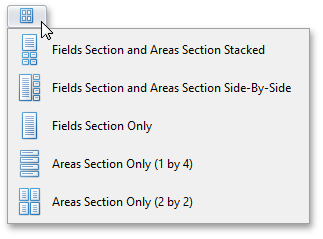

By default, an advanced Field List displays a hidden fields section on the top, and four sections that correspond to Pivot Table areas at the bottom (see [Field List Overview](../../../../interface-elements-for-desktop/articles/pivot-table/field-list-overview.md) for details).

You can use the _Layout_ menu to control which sections are displayed and where they are displayed. To do this, click the  button and select the required layout from the drop-down menu.

To learn more about Field Lists, see [Field List Overview](../../../../interface-elements-for-desktop/articles/pivot-table/field-list-overview.md).