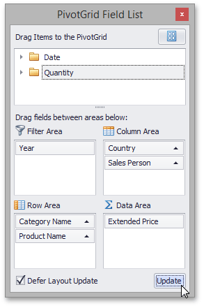

# Defer Pivot Table Updates
When you perform several sequential operations like hiding, displaying or reordering fields using an advanced Field List, Pivot Table is updated after each operation.

You can disable automatic Pivot Table updates by checking the **Defer Layout Update** check box. In this instance, use the **Update** button to force Pivot Table to update.

Note that if the **Defer Layout Update** check box is checked, you cannot sort or filter data in the Field List.

To learn more about Field Lists, see [Field List Overview](../field-list-overview.md).