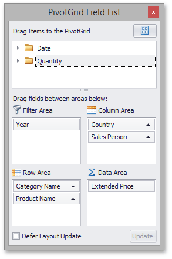
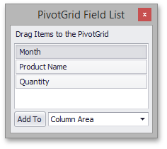
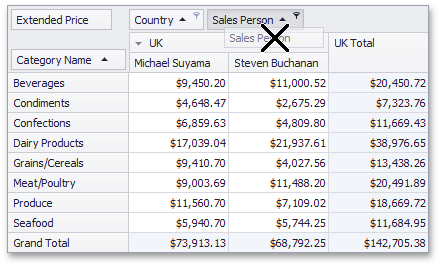

# Hide Fields Using a Field List
You can use a simple or an advanced Field List to hide fields (to learn more about Field Lists, see [Field List Overview](../../field-list-overview.md)).

&nbsp;&nbsp;

First, invoke a Field List. For information on how to do this, see [Invoke a Field List](../../field-list/invoke-a-field-list.md).

Then do one of the following:
* Drag a field away from the header panel, until the cursor changes its image to the big 'X'. Then drop the header.
	
	
* Drag and drop a field onto the Field List form.
	
	

If you are using an advanced Field List, you can hide a field by dragging its header to the hidden fields area displayed on the Field List top.

You can also hide fields using the context menu. To learn more, see [Hide Fields Using the Context Menu](hide-fields-using-the-context-menu.md).