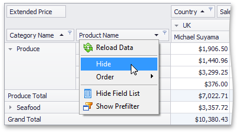

# Hide Fields Using the Context Menu
To hide a field, right-click its header and choose **Hide** from the context menu.

You can also use a Field List to hide fields. To learn more, see [Hide Fields Using a Field List](hide-fields-using-a-field-list.md).