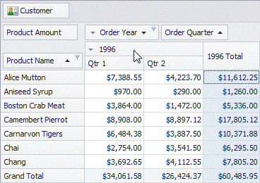

You can resize columns within the Pivot Table by dragging their borders.

> Regular, Total and Grand Total columns are resized independently. This means that resizing a regular column changes the width of all regular columns but does not affect Total and Grand Total columns, and vice versa.

Double-click a column border to automatically resize the column to the minimum width required to completely display its content.

