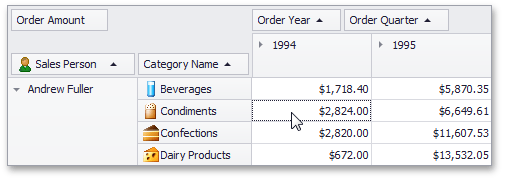
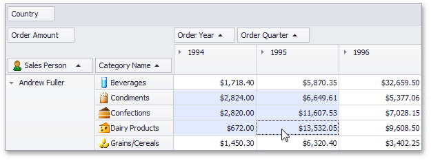
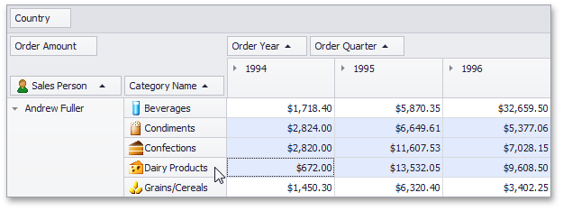

# Select Cells in Pivot Tables
Multiple cells can be selected simultaneously, and their contents can then be copied to the clipboard. This topic shows how.

## Select Cells and Clear the Current Selection
To select a single cell, do one of the following:
* Click the cell.
	
	
* Focus the cell using the ARROW keys.

To select a row or column of cells, click the appropriate header:

To select a continuous range of cells, do one of the following:
* Use  ARROW, PAGE UP, PAGE DOWN keys while holding the SHIFT key down.
* Press the mouse button over the starting cell and drag the mouse cursor towards the ending cell. Then release the mouse button.
	
	
* Click the starting cell. Then click the ending cell while holding the SHIFT key down.

To select a continuous range of columns or rows, do one of the following:
* Press the mouse button over the starting column/row header and drag the mouse cursor towards to the ending column or row header. Then release the mouse button.
	
	
* Click the starting column or row header. Then click the ending column/row header while holding the SHIFT key down.

To select all the cells, press CTRL+A.

## Select Cells While Preserving the Current Selection
Hold the CTRL key down while selecting cells.

## Copy Selected Cells to the Clipboard
Press CTRL+C or SHIFT+INS.