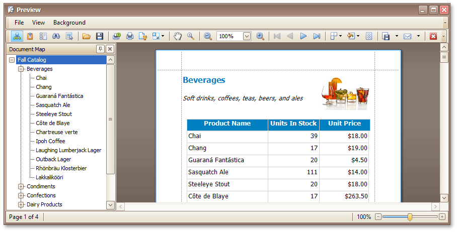

# Print Preview for WinForms
This section describes the capabilities provided by the Print Preview form.

&nbsp;

**File Management**
* [Save a Print Preview to a File](print-preview-for-winforms/file-management/save-a-print-preview-to-a-file.md)
* [Load a Print Preview from a File](print-preview-for-winforms/file-management/load-a-print-preview-from-a-file.md)

&nbsp;

**Printing and Page Setup**
* [Print a Document via the Print Dialog](print-preview-for-winforms/printing-and-page-setup/print-a-document-via-the-print-dialog.md)
* [Print a Document Using Default Settings](print-preview-for-winforms/printing-and-page-setup/print-a-document-using-default-settings.md)
* [Change Printing Settings via the Page Setup Dialog](print-preview-for-winforms/printing-and-page-setup/change-printing-settings-via-the-page-setup-dialog.md)
* [Specify Page Margins in Print Preview](print-preview-for-winforms/printing-and-page-setup/specify-page-margins-in-print-preview.md)

&nbsp;

**Headers and Footers**
* [Insert Page Header and Page Footer into Printed Documents](print-preview-for-winforms/headers-and-footers/insert-page-header-and-page-footer-into-printed-documents.md)
* [Insert Page Numbers into Printed Documents](print-preview-for-winforms/headers-and-footers/insert-page-numbers-into-printed-documents.md)
* [Insert Date and Time into Printed Documents](print-preview-for-winforms/headers-and-footers/insert-date-and-time-into-printed-documents.md)
* [Insert the User Name into Printed Documents](print-preview-for-winforms/headers-and-footers/insert-the-user-name-into-printed-documents.md)
* [Insert a Logo into Printed Documents](print-preview-for-winforms/headers-and-footers/insert-a-logo-into-printed-documents.md)

&nbsp;

**Scaling**
* [Scale Print Preview by Entering a Zoom Factor](print-preview-for-winforms/scaling/scale-print-preview-by-entering-a-zoom-factor.md)
* [Scale Print Preview by Specifying Width in Pages](print-preview-for-winforms/scaling/scale-print-preview-by-specifying-width-in-pages.md)

&nbsp;

**Zooming**
* [Zoom Print Preview In or Out](print-preview-for-winforms/zooming/zoom-print-preview-in-or-out.md)
* [Zoom Print Preview by Entering a Zoom Factor](print-preview-for-winforms/zooming/zoom-print-preview-by-entering-a-zoom-factor.md)
* [Zoom Print Preview to Show Whole Pages or Fit Content](print-preview-for-winforms/zooming/zoom-print-preview-to-show-whole-pages-or-fit-content.md)
* [Show Two or More Pages in Print Preview](print-preview-for-winforms/zooming/show-two-or-more-pages-in-print-preview.md)

&nbsp;

**Viewing and Navigating**
* [Navigate Between Pages in Print Preview](print-preview-for-winforms/viewing-and-navigating/navigate-between-pages-in-print-preview.md)
* [Use the Hand Tool in Print Preview](print-preview-for-winforms/viewing-and-navigating/use-the-hand-tool-in-print-preview.md)
* [Navigate in Print Preview Using Bookmarks](print-preview-for-winforms/viewing-and-navigating/navigate-in-print-preview-using-bookmarks.md)
* [Navigate in Print Preview Using Thumbnails](print-preview-for-winforms/viewing-and-navigating/navigate-in-print-preview-using-thumbnails.md)
* [Search for a Specific Text in Print Preview](print-preview-for-winforms/viewing-and-navigating/search-for-a-specific-text-in-print-preview.md)
* [Switch Print Preview Display Mode](print-preview-for-winforms/viewing-and-navigating/switch-print-preview-display-mode.md)

&nbsp;

**Interactivity**
* [Content Editing in Print Preview](print-preview-for-winforms/interactivity/content-editing-in-print-preview.md)

&nbsp;

**Watermark and Background**
* [Change Watermark and Background Settings in Print Preview](print-preview-for-winforms/watermark-and-background/change-watermark-and-background-settings-in-print-preview.md)
* [Remove a Watermark in Print Preview](print-preview-for-winforms/watermark-and-background/remove-a-watermark-in-print-preview.md)

&nbsp;

**Exporting**
* [Exporting from Print Preview](print-preview-for-winforms/exporting/exporting-from-print-preview.md)
* [PDF-Specific Export Options](print-preview-for-winforms/exporting/pdf-specific-export-options.md)
* [HTML-Specific Export Options](print-preview-for-winforms/exporting/html-specific-export-options.md)
* [MHT-Specific Export Options](print-preview-for-winforms/exporting/mht-specific-export-options.md)
* [RTF-Specific Export Options](print-preview-for-winforms/exporting/rtf-specific-export-options.md)
* [DOCX-Specific Export Options](print-preview-for-winforms/exporting/docx-specific-export-options.md)
* [XLS-Specific Export Options](print-preview-for-winforms/exporting/xls-specific-export-options.md)
* [XLSX-Specific Export Options](print-preview-for-winforms/exporting/xlsx-specific-export-options.md)
* [CSV-Specific Export Options](print-preview-for-winforms/exporting/csv-specific-export-options.md)
* [TXT-Specific Export Options](print-preview-for-winforms/exporting/txt-specific-export-options.md)
* [Image-Specific Export Options](print-preview-for-winforms/exporting/image-specific-export-options.md)

&nbsp;

**Passing Parameters**
* [Passing Parameters in Print Preview](print-preview-for-winforms/passing-parameters-in-print-preview.md)

&nbsp;

**Miscellaneous**
* [Customize Printing Settings of Charts](print-preview-for-winforms/miscellaneous/customize-printing-settings-of-charts.md)
* [Customize Printing Settings of Grids](print-preview-for-winforms/miscellaneous/customize-printing-settings-of-grids.md)
* [Customize Printing Settings of Pivot Tables](print-preview-for-winforms/miscellaneous/customize-printing-settings-of-pivot-tables.md)
* [Customize Printing Settings of Tree Views](print-preview-for-winforms/miscellaneous/customize-printing-settings-of-tree-views.md)

&nbsp;

**Warnings and Error Messages**
* [Warnings and Error Messages in Print Preview](print-preview-for-winforms/warnings-and-error-messages-in-print-preview.md)