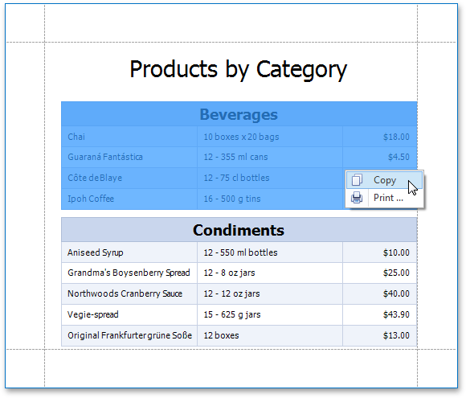

# Copy to the Clipboard
Aside from exporting a document to a third-party formatted file, you can copy a portion of the document content to the clipboard, and paste it into an editor compatible with one of the supported third-party formats.

To copy document content to the clipboard, do the following.
1. Select the content of the previewed document by holding down the left mouse button and dragging the mouse pointer, to create a selection box. Expand the selection box to fit all of the content you wish to print. The selected document elements are highlighted.
	
	
2. To copy the selected content, press **CTRL + C** or right-click anywhere within the highlighted area of the document, and select **Copy** in the context menu.
	
	

When pasted to a third-party editor from the clipboard, the report content will automatically be converted to the target format.