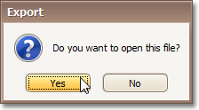

# Exporting from Print Preview
There are two options available for a document being exported to.
* [Export Document to a File on Disk](#disk)
* [Send Exported File via E-Mail](#mail)

## <a name="disk"/>Export Document to a File on Disk
To export a document and save the resulting file on your hard drive, do one of the following.
* On the toolbar, click the arrow near the **Export Document...** button .
* On the **File** menu, choose the **Export Document...** item.

Choose the required format from the invoked list.

Then, you may be prompted to define format-specific options. See corresponding help topics in this documentation for details, e.g. PDF-Specific Export Options.

Once you've specified exporting options, the **Save As** dialog appears, allowing you to enter the file name. Then, the following message will be invoked.

Click **Yes**, if you want to preview the exported file.

## <a name="mail"/>Send Exported File via E-Mail
To send the resulting PDF file via e-mail, do one of the following.
* On the toolbar, click the arrow near the **Send via E-Mail...** button .
* On the **File** menu, choose the **Send via E-Mail...** item.

Choose the required format in the invoked list.

Then, you may be prompted to define format-specific options. See corresponding help topics in this documentation for details, e.g. PDF-Specific Export Options.

Once you've specified exporting options, the **Save As** dialog appears, allowing you to enter the file name.

Finally, the created document will be attached to a new empty message, created in your default mail program.