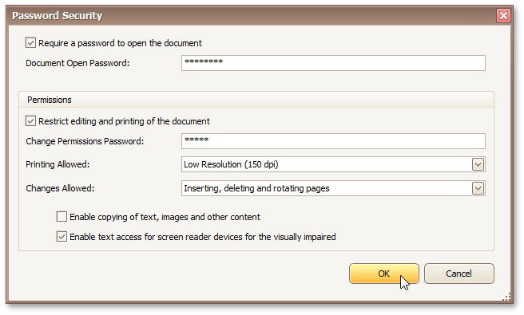

# PDF-Specific Export Options
When [exporting a document](exporting-from-print-preview.md), you can define PDF-specific exporting options using the following dialog.

**General Options**
* **Page range**
	
	Specifies a range of pages which will be included in the resulting file. To separate page numbers, use commas. To set page ranges, use hyphens.
* **Don't embed these fonts**
	
	Specifies font names which should not be embedded into the resulting file to reduce the file size. To separate fonts, use semicolons.
* **Convert Images to Jpeg**
	
	Specifies whether all bitmaps contained in the document should be converted to JPEG format during export to PDF.
* **Images quality**
	
	Specifies the document's image quality level. The higher the quality, the bigger the file, and vice versa.
* **Compressed**
	
	Specifies whether the resulting file should be compressed.
* **PDF/A-2b**
	
	Specifies whether to enable document compatibility with the **PDF/A-2b** specification.

**Password Security Options**

These options allow you to adjust the security options of the resulting PDF file (e.g. enable open document, editing, printing and copying protection, and specify which changes are allowed).

**Signature Options**

If an X.509 certificate is applied to your report, you can maintain its options using the **Signature Options** property of the report **PDF Export Options**.

**Additional Options**

You can also fill the **Application**, **Author**, **Keywords**, **Subject**, and **Title** fields. These options specify the **Document Properties** of the created PDF file.