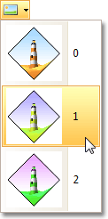

# Insert a Logo into Printed Documents
To insert a logo into a document's header or footer, first [invoke the Header and Footer dialog](insert-page-header-and-page-footer-into-printed-documents.md).

Then, focus an appropriate text box, depending on the required alignment, and click the **Image**  button.

Select the image from the dropdown list.

Click OK to save changes and close the dialog.

> [!NOTE]
> If the **Image** button is disabled, then logo insertion is not supported by your software vendor.