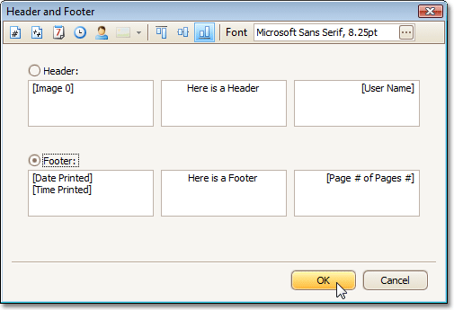

# Insert Page Header and Page Footer into Printed Documents
To insert a page header and page footer into a document, click the **Header and Footer**  button on the toolbar. This will invoke the **Header and Footer** dialog.

Specify header and footer content using the appropriate text boxes, depending on the required alignment.

If needed, you can also adjust vertical alignment and font settings.

Click OK to save changes and close the dialog.