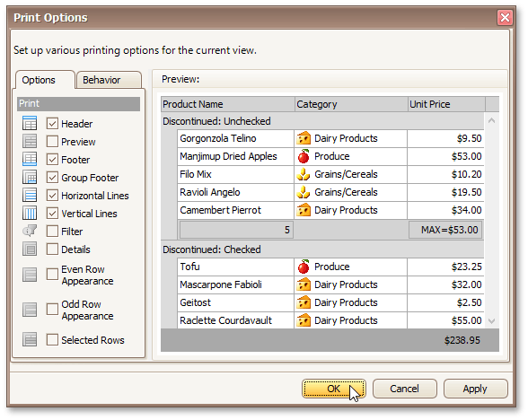

# Customize Printing Settings of Grids
If allowed by your application vendor, you can customize additional print settings of a document. For example, if you are about to print out a grid, you may be able to customize grid printing options.

To do this, click the **Customize**  button on the toolbar. The **Print Options** dialog will be invoked.

* **Options tab**
	
	Allows you to uncheck elements that you don't want to print.
* **Behavior tab**
	
	Allows you to pre-process a grid before printing it. For instance, you can enable automatic column width calculation, or automatic group row expansion.