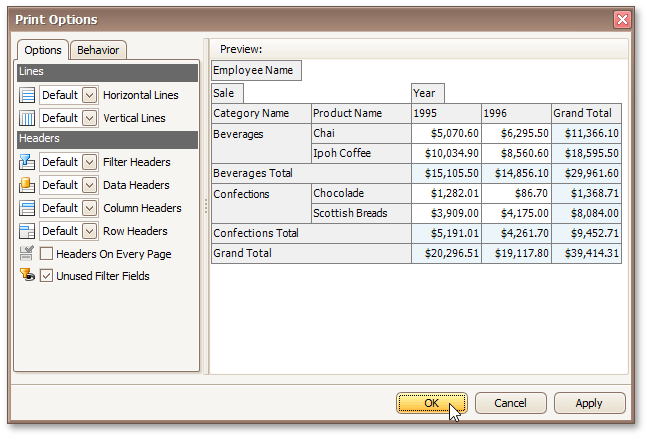

# Customize Printing Settings of Pivot Tables
If allowed by your application vendor, you can customize additional print settings of a document. For example, if you are about to print out a Pivot Table, you may be able to customize its printing options.

To do this, click the **Customize**  button on the toolbar. The **Print Options** dialog will be invoked.

* **Options tab**
	
	Allows you to specify which elements are to be printed.
* **Behavior tab**
	
	Allows you to pre-process a Pivot Table before printing it. For instance, you can enable field value merging.