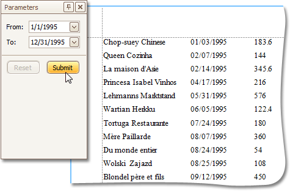

# Passing Parameters in Print Preview
Some documents or reports allow you to control data display, and what data is to be displayed by specifying parameter values.

To show the Parameters window, click the **Parameters**  button on the main toolbar. A window allowing you to change parameter values will be invoked.

Enter the required values and click **Submit**. After changing the current values, you can revert back the previously selected values by clicking **Reset**.

