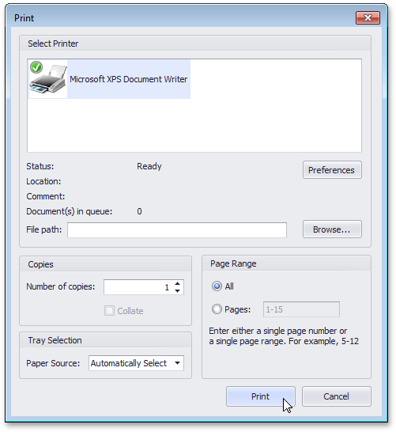

# Print a Document via the Print Dialog
To print a document, do one of the following.
* Click the **Print**  button on the toolbar, or press CTRL+P.
* On the **File** menu, click **Print...**.

The **Print** dialog will be invoked.

Specify the necessary settings and click **Print**.

To print a document without invoking the **Print** dialog, see the [Print a Document Using Default Settings](print-a-document-using-default-settings.md) topic.

 
> [!NOTE]
> If you try to print a document whose margins are outside of the printable area, you'll see a [warning message](../warnings-and-error-messages-in-print-preview.md). Click **Yes** to print the document anyway, if you are sure that your printer supports the specified page margins.