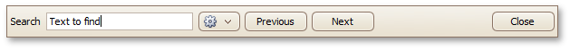

# Search for a Specific Text in Print Preview
To search for a specific text throughout a document, click the **Search**  button on the toolbar, or press CTRL+F. This invokes the Search panel.

To start searching for the terms, click **Next** or press ENTER. To find the next occurrence of the terms, do the same. To find the previous occurrence of the terms, click **Previous**.

The Search panel also provides the settings button, which invokes the dedicated submenu allowing you to specify whether or not to use a case-sensitive search and whether or not you need to match the whole word during the search.

