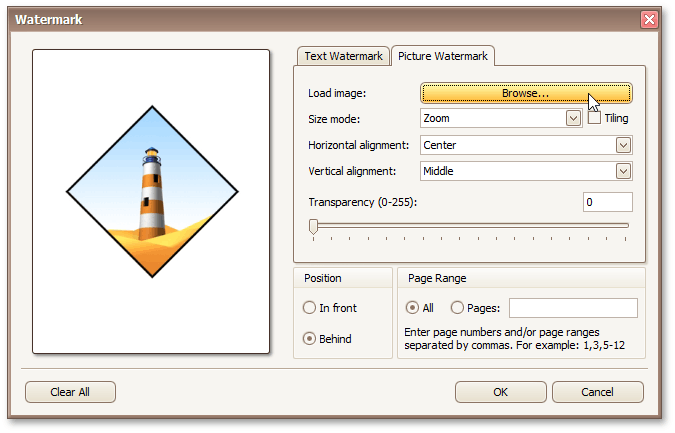
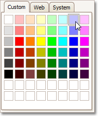

# Change Watermark and Background Settings in Print Preview
## Invoke the Watermark Dialog
To add a watermark to a document,  click the **Watermark**  button on the toolbar, or click **Watermark...** on the **Background** menu. The **Watermark** dialog will be invoked.

## Add a Text Watermark
To add a text watermark, open the **Text Watermark** tab.

Input the required text, or choose one from the provided options. If required, define other text properties, such as direction, color, font, size, transparency, etc.

## Add an Image Watermark
To add a picture watermark, open the **Picture Watermark** tab.

Load the image and customize its properties, such as size mode, horizontal and vertical alignment, tiling, transparency, etc.

## Specify the Pages Where you will Display Your Watermark
Specify the required pages to apply a watermark in the **Page Range** section of the dialog.

Separate page numbers with commas, or specify page ranges using a dash.

## Add a Background Color to a Document
To add a background color to a document, click the **Background Color**  button on the toolbar, or click **Color...** on the **Background** menu. The **Background Color** dialog will be invoked.

Then, choose a color from the **Custom**, **Web** or **System** palettes.