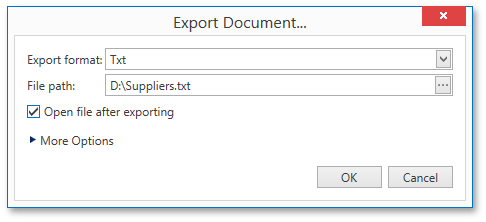
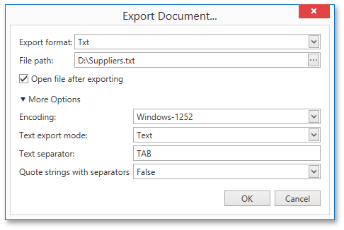
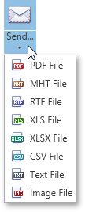
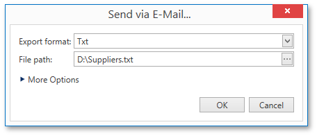

# Exporting
There are two options available for exporting a document to one of the supported third-party formats.
* [Export Document to a File on Disk](#export)
* [Send Exported File Using E-Mail](#send)

<a name="export"/>

## Export Document to a File on Disk
To export a document and save the resulting file on your hard drive, click the arrow for the **Export...** button and select the required format from the list.

This invokes the **Export Document...** dialog with options for the selected format.

If you simply click the **Export...** button, the dialog will provide settings for the PDF format. Then, you can always change the export format directly in the dialog using the dedicated **Export format** drop-down list.

In the **Export Document...** dialog, you should specify the path where the resulting file should be saved and choose whether or not to open the file after exporting.

To access and customize advanced export options for the selected format, click the **More Options** link.

Specify the required format-specific options and click **OK** to initiate export of a report and save the resulting file.

<a name="send"/>

## Send Exported File Using E-Mail
To export a document and send the resulting file using e-mail, click the arrow for the **Send...** button and select one of the supported formats.

This invokes the **Send via E-Mail...** dialog with options for the selected format.

If you simply click the **Send...** button, the dialog will provide settings for the PDF format. Then, you can always change the export format directly in the dialog using the dedicated **Export Format** drop-down list.

In the **Send via E-Mail...** dialog, you should specify the path where the resulting file should be saved. The dialog also allows you to specify advanced export options for the selected format. To access and customize these format-specific options, click the **More Options** link.

Specify the required options and click **OK** to initiate export of a report and save the resulting file. The saved file will be then attached to a new empty message in the default mail program.