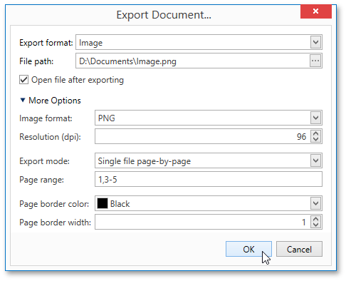

# Image-Specific Export Options
When [exporting a document](exporting.md), you can define the following Image-specific exporting options.

* **Image format**
	
	Specifies an image format to export a document. Available formats are BMP, EMF, WMF, GIF, JPEG, PNG, and TIFF.
* **Resolution (dpi)**
	
	Specifies the required image resolution (in dpi).
* **Export mode**
	
	Specifies how a document is exported to an image. The following modes are available.
	* The **Single file** mode allows export of a document to a single file, without dividing the output into pages.
	* The **Single file page-by-page** mode allows export of a document to a single file, divided into pages. In this mode, the **Page range**, **Page border color** and **Page border width** options are available.
	* The **Different files** mode allows export of a document to multiple files, one for each document page. In this mode, the **Page range**, **Page border color** and **Page border width** options are available.
* **Page range**
	
	Specifies a range of pages which will be included in the resulting file. To separate page numbers, use commas. To set page ranges, use hyphens.
* **Page border color**
	
	Specifies the color of page borders.
* **Page border width**
	
	Specifies the width (in pixels) of page borders.