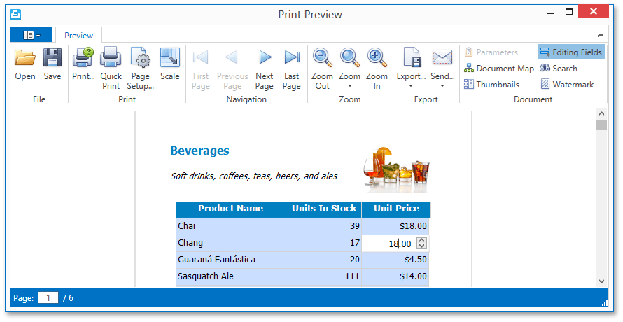

# Content Editing in Print Preview
If content editing is enabled for document elements, it is possible to customize the corresponding field values in Print Preview.

To highlight all editing fields available in the document, click the **Editing Fields**  button on the toolbar. This button is not available when there are no such fields in the document.

Clicking a field will invoke an appropriate editor. To apply the entered values and navigate between editing fields, use the TAB and SHIFT+TAB keys. In addition to editing text, you can switch check box states.

