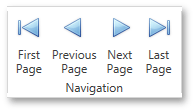

# Navigate Between Pages
To navigate between document pages, use the scrollbars or navigation buttons on the Print Preview's toolbar. These buttons allow you to switch to the first, previous, next, or last page of a document.

To navigate to a specific page of a document, enter the required page in the dedicated editor in the Print Preview's status bar.

