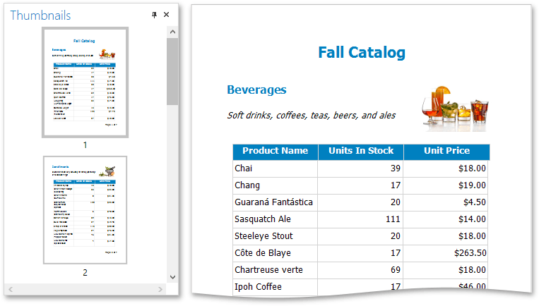

# Navigate Using Thumbnails
You can use thumbnails to quickly navigate between document pages.

To show thumbnails, click the **Thumbnails**  button on the Print Preview's toolbar. Click a thumbnail to navigate to the corresponding document page.

