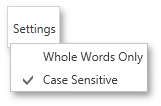

# Search for a Specific Text
To search for a specific text throughout a document, click the **Search**  button on the Print Preview's toolbar, or press CTRL+F. This invokes the **Search** panel.

In the search box on the left, input the text to find. Click the **Settings** button to invoke the dedicated submenu allowing you to specify whether or not to use a case-sensitive search, and specify if you are required to match the whole word during the search.

To start searching, or search down again, click **Next**, or press ENTER or CTRL+G. To search backward, click **Previous** or press CTRL+SHIFT+G.