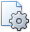

# Change Print Settings Using the Page Setup Dialog
To invoke the **Page Setup** dialog, click the **Page Setup...**  button on the Print Preview's toolbar.

The **Page Setup** dialog allows you to do the following.
* Change the paper size using the dedicated drop-down.
* Select page orientation (Portrait or Landscape).
* Specify page margins by entering the required top, left, bottom and right page margin values into the appropriate editors.

> [!NOTE]
> If you're working with a document that was [loaded from a file](../file-management/load-a-print-preview-from-a-file.md), the **Page Setup** button on the toolbar is disabled.