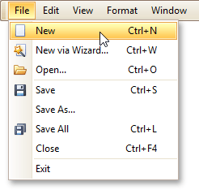
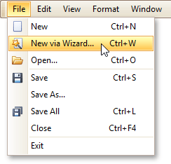

# Create a New Report
This topic explains how to create a new blank report in the Report Designer. Before you start, make sure to [back up the current report](../../report-editing-basics/back-up-the-current-layout-before-modifying-it.md).

To create a new report, do one of the following.

## Create a New Blank Report
In the [Main Menu](../../report-designer-reference/report-designer-ui/main-menu.md), click **File** and then **New** (or press CTRL+N).

The [Main Toolbar](../../report-designer-reference/report-designer-ui/main-toolbar.md) contains a button () with the same function.

If there is another report already loaded in the designer, you may be prompted whether it should be saved before it is replaced with a newly created report.

By default, the created report contains three [bands](../../report-designer-reference/report-bands.md) - [Page Header and Footer](../../report-designer-reference/report-bands/page-header-and-footer.md), and the [Detail band](../../report-designer-reference/report-bands/detail-band.md).

## Create a New Report Using the Report Wizard
In the [Main Menu](../../report-designer-reference/report-designer-ui/main-menu.md), click **File** and then **New via Wizard...** (or press CTRL+W).

For more information about this option, refer to [Report Wizard](../../report-wizard.md).