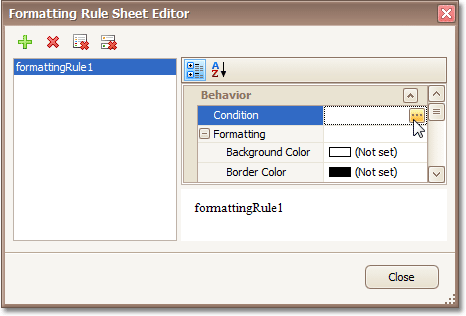
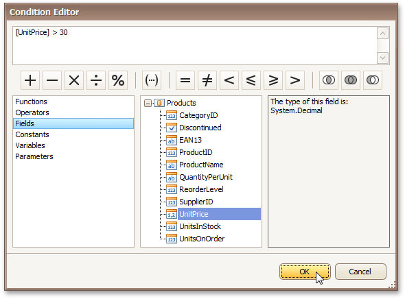
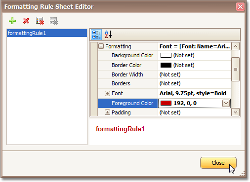
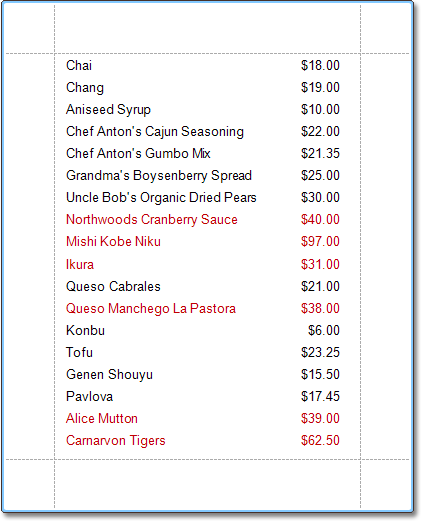

# Conditionally Change a Control's Appearance
This tutorial describes the steps to conditionally change a control's appearance (e.g. make a [Label](../../report-designer-reference/report-controls/label.md)'s text red if its value exceeds some threshold). Thanks to the _formatting rules_ feature, to achieve this, no [scripts](../miscellaneous/handle-events-via-scripts.md) are required, so you shouldn't write any code.

To conditionally change a control's appearance, do the following.
1. [Create a data-aware report](../../report-editing-basics/displaying-values-from-a-database-(binding-report-elements-to-data).md).
2. Click the report's [Smart Tag](../../report-designer-reference/report-designer-ui/smart-tag.md), and in the invoked actions list, click the ellipsis button for the **Formatting Rule Sheet** option.
	
	
	
	And, in the invoked **Formatting Rule Sheet Editor**, create a new _formatting rule_ (by using the  button), and click the ellipsis button for its **Condition** property.
	
	
3. Then, in the invoked **Condition Editor**, define the required _Boolean_ condition (which means that its result is returned as either _true_ or _false_). In this tutorial, we will format fields if the **UnitPrice** value is greater than **30**.
	
	
	
	To save the condition and close the dialog, click **OK**.
4. Now, back in the **Formatting Rule Sheet Editor**, define the formatting to be applied (e.g. specify the desired font color).
	
	
	
	To save the changes and quit the dialog, click **Close**.
5. Finally, select the band or control to which the formatting rule must be applied (in this example it is the [Detail band](../../report-designer-reference/report-bands/detail-band.md)), and via its Smart Tag, access its collection of **Formatting Rules**.
	
	
	
	And, in the invoked **Formatting Rules Editor**, move the rule from left to right (using the **&#62;** button), for it to come into effect for this band.
	
	
	
	If multiple rules are applied, it is possible to customize their precedence, by using the up and down arrow buttons at the right of the dialog. So, the rules are applied in the same order that they appear in the list, and the last rule in the list has the highest priority.

The result is shown in the following image.

