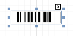
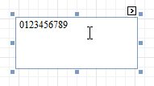
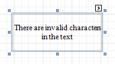

# Bar Code
The **Bar Code** control transforms its content into a bar code of the specified type. Multiple standard bar code symbologies are supported.

> [!NOTE]
> The barcode quality can degrade when the report is exported to formats other than PDF. To ensure reliable barcode recognition, print the report directly from an application using the native printing methods. The **Module** and **Auto-Module** properties of a control should be used with care.

In the [Property Grid](../report-designer-ui/property-grid.md), the Bar Code's properties are divided into the following groups.

## Appearance
* **Alignment**
	
	Determines the alignment of the barcode image within the control. To define the text alignment, use the Text Alignment property.
* **Background Color**
	
	Specifies the background color for the control. This option is also available in the [Formatting Toolbar](../report-designer-ui/formatting-toolbar.md) ().
* **Borders**, **Border Color**, **Border Dash Style** and **Border Width**
	
	Specify border settings for the control.
* **Font**
	
	Specifies the font settings for the control. Some of these settings are available in the [Formatting Toolbar](../report-designer-ui/formatting-toolbar.md).
* **Foreground Color**
	
	Specifies the text and image color for the bar code. This option is also available in the [Formatting Toolbar](../report-designer-ui/formatting-toolbar.md) ().
* **Formatting Rules**
	
	Invokes the Formatting Rules Editor, allowing you to choose which rules should be applied to the control during report generation, and define the precedence of the applied rules. To learn more on this, refer to [Conditionally Change a Control's Appearance](../../create-reports/styles-and-conditional-formatting/conditionally-change-a-controls-appearance.md).
* **Padding**
	
	Specifies indent values which are used to render the contents of a Bar Code.
* **Style Priority**
	
	Allows you to define the priority of various style elements (such as background color, border color, etc.). For more information on style inheritance, refer to [Understanding Style Concepts](../../create-reports/styles-and-conditional-formatting/understanding-style-concepts.md).
* **Styles**
	
	Specifies [odd and even styles](../../create-reports/styles-and-conditional-formatting/use-odd-and-even-styles.md) for the control and enables you to assign an existing style to the control (or a newly created one). To learn more, see [Understanding Style Concepts](../../create-reports/styles-and-conditional-formatting/understanding-style-concepts.md).
* **Text Alignment**
	
	Allows you to change the alignment of the control's text. This option is also available in the [Formatting Toolbar](../report-designer-ui/formatting-toolbar.md). To define the alignment of the barcode image, use the Alignment property.

## Behavior
* **Anchor Horizontally**
	
	Specifies the horizontal anchoring style of the control, so that after page rendering it stays attached to the left control, right control, or both. This property defines how a report control is resized to maintain the distance to the left and right edges of its container control.
* **Anchor Vertically**
	
	Specifies the vertical anchoring style of the control, so that, after page rendering, it stays attached to the top control, bottom control, or both.
* **Auto-Module**
	
	When this property is set to Yes, the barcode image is stretched to fit the entire control's width. When this option is turned off, this behavior is determined by the Module property.
* **Can Publish**
	
	Specifies whether or not a report control is displayed in a printed or exported document.
* **Keep Together**
	
	Specifies whether the contents of the control can be horizontally split across pages. In other words, if the control occupies more space than remains on the page, this property specifies whether this Bar Code should be split between the current page and the next, or whether it will be printed entirely on the next page. This property is in effect only when a Bar Code's content does not fit on the current page. If it does not fit on the next page either, then the Bar Code will be split, despite this property's value.
* **Module**
	
	Specifies the width of the narrowest bar or space in the barcode, measured in [report units](../../create-reports/basic-operations/change-measurement-units-of-a-report.md). You may set this property to Yes for automatic adjustment of its value, when the control is resized. Note that if the Module value is too low, the barcode output may become unreadable by a barcode scanner.
	
	When the Auto-Module property is set to No, there could be a situation when the barcode image generated with the current setting of Module property is larger than the control itself. In this case, the control displays a warning, as illustrated below.
	
	
	
	So, increase the dimensions of the control, to avoid this.
* **Orientation**
	
	The barcode image within the control can be rotated. If you need this feature, use the Orientation property to specify one of four possible orientations (Normal, Upside Down, Rotate to the Left and Rotate to the Right) for an image within the control.
* **Process Duplicates Mode**
	
	Determines the control's behavior when its data source contains consecutive repeating records. They can be processed as is (when the property is set to Leave), suppressed except for the first entry (Suppress) and suppressed with the blank space printed instead of the repeated records (Suppress and Shrink).
	
	When the MergeByValue and MergeByTag settings are selected, the control processes duplicate values by merging the identical content into a single line of text.
* **Process Duplicates Target**
	
	Specifies whether to process duplicate values of the control's Text or Tag property.
* **Process Null Values**
	
	Determines whether to process Null (blank) values if they appear in the control's data source. They can be processed as is (when the property is set to Leave), suppressed (Suppress) and suppressed with the blank space printed instead of the blank records (Suppress and Shrink).
* **Scripts**
	
	This property contains events, which you can handle with the required scripts. For more information on scripting, refer to [Handle Events via Scripts](../../create-reports/miscellaneous/handle-events-via-scripts.md).
* **Show Text**
	
	Determines whether to display the numerical value, or only the barcode within the control.
* **Symbology**
	
	The Symbology defines the mapping between barcode text and an image. The symbologies supported by the Bar Code control are listed in the following table:

| **Symbology** | **Description** |
|---|---|
| **Codabar** | The Codabar is an old format that uses discrete, self-checking symbology, capable of encoding 16 different characters, plus an additional 4 start/stop characters. You should also specify the **Start and Stop Symbols** and **Wide Narrow Ratio** properties. |
| **Code11** | Code 11, also known as USD-8, was developed as a high-density numerical-only symbology. The symbology is discrete, and is able to encode the numbers 0 through to 9, the dash symbol (-), and start/stop characters. |
| **Code128** | Code 128 has been widely implemented. It is a high-density symbology which permits encoding messages of arbitrary lengths of any character of the ASCII character set. The symbology includes a checksum digit for verification. You should also specify the **Character Set**. The recommended setting is **Auto Charset**. |
| **Code39** | Code 39 is also known as "3 of 9 Code" and "USD-3". It can encode uppercase letters (A through Z), digits (0 through 9) and several special characters like the $ sign. The **Calculate a Checksum** and **Wide Narrow Ratio** (which should be in a range of 2.2 -3) properties can also be specified. |
| **Code39Extended** | This is an extension of Code 39, also known as "Full ASCII Code 39". It is capable of encoding all 128 ASCII characters. The **Calculate a Checksum** and **Wide Narrow Ratio** (which should be in a range of 2.2 -3) properties can be specified. |
| **Code93** | Code 93 was designed to supplement and improve Code 39. It is an alphanumeric, variable length symbology, providing higher reliability and density than Code 39. The **Calculate a Checksum** property can be specified. |
| **Code93Extended** | It enables encoding of all 128 ASCII characters using Code 93's "Full ASCII Mode". This is accomplished by using the ($), (/), (%), and (+) symbols as "shift" characters. The **Calculate a Checksum** property can be specified. |
| **CodeMSI** | MSI symbology, also known as Modified Plessey, is a low-density, numerical only symbology. To specify the checksum, use the **MSI Checksum** property. It can be set to None, Modulo 10 and Double Modulo 10. |
| **DataMatrix** | Data Matrix ECC200 code is a two-dimensional matrix barcode consisting of black and while "cells" arranged in a square or a rectangular pattern. The encoded information can be text or raw data. |
| **DataMatrix GS1** | GS1 DataMatrix uses a special start combination to differentiate the GS1 DataMatrix symbol from the other Data Matrix ECC 200 symbols. The Bar Code control now supports this symbology. |
| **EAN128** | UCC/EAN-128 symbology has the newer name GS1-128. It is based on the Code128 standard, additionally specifying the Application Identifiers for data sections within the code. It includes best before dates, batch numbers, quantities, weights and other attributes. The **Character Set** property can be specified (**Auto Charset** is the recommended value). The **FNC1 Functional Character** property defines a symbol that is not included in a bar code when met in text, but used to generate the application identifiers. The **Human-Readable Text** property, when set to Yes, inserts parentheses into the text below the bar code for better readability. |
| **EAN13** | The EAN-13 barcode contains 13 digits, no letters or other characters. The first two or three digits represent the country. The leading zero actually signifies the USA, and UPC-A coding. The last digit is the checksum digit. The control calculates it automatically and it should not be present in the control's text string. So, make sure that the text for this symbology contains no more than 12 digits. If fewer digits are supplied, the string is padded with zeroes on the left. |
| **EAN8** | EAN-8 is a shortened version of the EAN-13 code. It includes a 2 or 3 digit country code, 4 of 5 data digits (depending on the length of the country code), and a checksum digit. The control calculates the checksum digit automatically and it should not be present in the control's text string. So, make sure that the text for this symbology contains no more than 7 digits. If fewer digits are supplied, the string is padded with zeroes on the left. |
| **GS1 Data Bar** | This bar code is based on a family of symbols often used in the **GS1 DataBar Coupon** (coupon codes commonly used in retail). These bar codes can encode up to **14** digits, which makes them suitable for **GTIN 8**, **12**, **13** and **14**. **GS1 DataBar Expanded** and **GS1 DataBar Expanded Stacked** can encode up to **74** numeric or **41** alphanumeric characters, and provide the capability to utilize all **GS1 Application Identifiers** (e.g., expiration date, batch and serial number). These bar codes are often used in manufacturer coupons. |
| **Industrial2of5** | The Industrial (or non-interleaved) 2 of 5 code is a numerical, low-density symbology, based on two-out-of-five code. The **Calculate a Checksum** and **Wide Narrow Ratio** (which should be greater than or equal to 2.5) properties can be specified. |
| **Intelligent Mail** | The Intelligent Mail (IM) code is a 65-bar code for use on mail in the United States. The Intelligent Mail barcode is a height-modulated barcode that encodes up to 31 decimal digits of mail-piece data into 65 vertical bars. |
| **Intelligent Mail Package** | The Intelligent Mail Package Barcode (IMPB) was developed for the use on mail in the United States. Barcodes of this symbology are used only for packages as opposed to Intelligent Mail barcodes, which are used for postcards, letters, and flats. |
| **Interleaved2of5** | The Interleaved 2 of 5 code is a higher-density numerical symbology, based on two-out-of-five code. The **Calculate a Checksum** and **Wide Narrow Ratio** (which should be greater than or equal to 2.5) properties can be specified. |
| **ITF-14** | This bar code, also known as "**UPC Shipping Container Symbol**", is used to mark packaging materials that contain products labeled with a UPC or EAN product identification number. This bar code provides a GS1 implementation of an **Interleaved 2-of-5** symbology for encoding a **Global Trade Item Number** (an identifier for trade items developed by GS1). This bar code always uses a total of **14** digits. |
| **Matrix2of5** | A variant of non-interleaved 2 of 5 code. It is a numerical only symbology. The **Calculate a Checksum** and **Wide Narrow Ratio** (which should be greater than or equal to 2.5) properties can be specified. |
| **PDF417** | This Portable Data File symbology is used in a variety of applications, and can also be used to generate postage accepted by the United States Postal Service. It consists of a variable number of rows, each of which is like a small linear bar code. Among other options, the **Error Correction Level** specifies the amount of redundancy, to protect a barcode's legibility. |
| **PostNet** | This symbology is used by the United States Postal Service to assist in directing mail. The code usually contains the zip-code and delivery point number. Unlike most other barcodes, PostNet actually encodes data in the height of the bars. |
| **QR Code** | QR (Quick Response) Code is a popular two-dimensional matrix barcode that consists of black modules arranged in a square pattern on a white background. |
| **UPCA** | The UPC-A barcode contains 12 digits, no letters or other characters. The first digit is the prefix signifying the product type. The last digit is the "check digit". The check digit is calculated using the first eleven figures when the barcode is constructed. So, for a correct UPC-A, make sure that the text contains no more than 11 digits. If there are fewer than 11, the string is padded with zeroes on the left. |
| **UPCE0** | This symbology is a variation of UPC-A which allows for a more compact barcode by eliminating "extra" zeros. The first digit is always zero; the last digit is a checksum digit of the original UPC-A code. Not every UPC-A code can be transformed into UPC-E0. E.g., the control's text string "4210000526" is displayed by UPC-E0 symbology as "04252614" and represents the "042100005264" UPC-A code (check digit included). |
| **UPCE1** | This symbology is a variation of UPC-A, which allows for a more compact barcode by eliminating "extra" zeros. The first digit is always 1, and the last digit is a checksum digit of the original UPC-A code. Not every UPC-A code can be transformed into UPC-E1. E.g., the control's text string "4210000526" is displayed by UPC-E1 symbology as "14252611" and represents the "142100005261" UPC-A code (check digit included). |
| **UPCSupplemental2** | This is a supplemental two-digit barcode. Make sure that the control's text string contains two digits. |
| **UPCSupplemental5** | This is a supplemental five-digit barcode, usually used to indicate the suggested retail price of a book. Make sure that the control's text string contains five digits. |
* **Visible**
	
	Specifies whether the control should be visible in print preview.

## Data
* **(Data Bindings)**
	
	If the current report is [bound to data](../../create-reports/binding-a-report-to-data.md), this property allows you to bind some of the control's properties (Bookmark, Navigation URL, Tag and Text) to a data field obtained from the report's data source, and to apply a [format string](../../report-editing-basics/change-value-formatting-of-report-elements.md) to it. For more information on this, refer to [Displaying Values from a Database (Binding Report Elements to Data)](../../report-editing-basics/displaying-values-from-a-database-(binding-report-elements-to-data).md).
* **Tag**
	
	This property allows you to add additional information to the control; for example its id, by which it can then be accessible via [scripts](../../create-reports/miscellaneous/handle-events-via-scripts.md).
	
	If the current [report has a data source](../../create-reports/binding-a-report-to-data.md), the Tag property can  be bound to a data field obtained from the data source. To do this, expand the (Data Bindings) property, and in the Tag.Binding drop-down selector, select the required data field.
* **Text**
	
	Allows you to define a string to be encoded as a barcode. You can define whether to display this value within the control using the Show Text property. Note that when the control is selected in the designer, you may simply start typing the text, and it will be automatically entered into the in-place editor.
	
	
	
	If the content does not conform to the rules of a certain symbology (determined by the Symbology property), the control may display a warning, as in the picture below, or automatically correct the input string by padding it with zeroes or only allowing an acceptable number of characters to be displayed.
	
	
	
	If the current [report has a data source](../../create-reports/binding-a-report-to-data.md), the Text property can be bound to a data field obtained from the data source. To do this, expand the (Data Bindings) property, and in the Text.Binding drop-down selector, select the required data field. For more information on this, refer to [Displaying Values from a Database (Binding Report Elements to Data)](../../report-editing-basics/displaying-values-from-a-database-(binding-report-elements-to-data).md).

## Design
* **(Name)**
	
	Determines a control's name, by which it can be accessed in the [Report Explorer](../report-designer-ui/report-explorer.md), [Property Grid](../report-designer-ui/property-grid.md) or via [scripts](../../create-reports/miscellaneous/handle-events-via-scripts.md).

## Layout
* **Location**
	
	Specifies the control's location, measured in [report units](../../create-reports/basic-operations/change-measurement-units-of-a-report.md).
* **Size**
	
	Specifies the control's size, measured in [report units](../../create-reports/basic-operations/change-measurement-units-of-a-report.md).
* **Snap Line Margin**
	
	Specifies the margin (measured in [report units](../../create-reports/basic-operations/change-measurement-units-of-a-report.md)), which is to be preserved around the control when it is [aligned using Snap Lines](../../create-reports/basic-operations/controls-positioning.md), or when other controls are aligned next to it.

## Navigation
* **Bookmark** and **Parent Bookmark**
	
	These properties are intended for the creation of a hierarchical structure within a report, called a document map. For an explanation and help, refer to [Add Bookmarks](../../create-reports/report-navigation-and-interactivity/add-bookmarks.md).
	
	If the current [report has a data source](../../create-reports/binding-a-report-to-data.md), the Bookmark property can be bound to a data field obtained from the data source. To do this, expand the (Data Bindings) property, and in the Bookmark.Binding drop-down selector, select the required data field.
* **Navigation URL** and **Navigation Target**
	
	Use the Navigation URL property to specify a URL for web browser navigation when a user clicks a Bar Code. The web browser displays a page in a window or a frame as specified by the Navigation Target property. Note that a URL should have an appropriate prefix (e.g. "http://"). You can create cross-references within the report by assigning the name of the target control to the Navigation URL property, and setting the Navigation Target property to "_self". For more information, refer to [Create Hyperlinks](../../create-reports/report-navigation-and-interactivity/create-hyperlinks.md).
	
	If the current [report has a data source](../../create-reports/binding-a-report-to-data.md), the Navigation URL property can be bound to a data field obtained from the data source. To do this, expand the (Data Bindings) property, and in the Navigation URL.Binding drop-down selector, select the required data field.