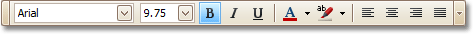

# Formatting Toolbar
The **Formatting Toolbar** allows you to easily customize an element's font, color and alignment settings.

If the Formatting Toolbar is hidden, you can enable it in the [Main Menu](main-menu.md), by selecting **View** | **Toolbars** | **Formatting Toolbar**.