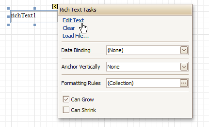

# Add or Modify Static Information in Your Report
In a report, _static_ and _dynamic_ information is displayed using appropriate [controls](../report-designer-reference/report-controls.md).

**Dynamic information** changes through a report, such as [values from a database](displaying-values-from-a-database-(binding-report-elements-to-data).md) (which comprise the main report data) or [service information](add-page-numbers-and-system-information-to-a-report.md) (such as [current user name or page numbers](add-page-numbers-and-system-information-to-a-report.md)). Approaches to embed dynamic information to your report are detailed in the following document: [Displaying Values from a Database (Binding Report Elements to Data)](displaying-values-from-a-database-(binding-report-elements-to-data).md).

**Static information** is text or images that aren't obtained from a data source, and therefore don't change through the report, and don't depend on the current computer. Static information can be printed only once (e.g. in a [Report Header](../report-designer-reference/report-bands/report-header-and-footer.md)), can repeat on each page (e.g. in a [Page Header](../report-designer-reference/report-bands/page-header-and-footer.md)) or can repeat with every entry in your report's data source (a data-bound label, which is placed onto the [Detail band](../report-designer-reference/report-bands/detail-band.md)).

Static information can be either [edited in-place](#inplace), or [loaded from an external file](#loaded).

## <a name="inplace"/>Change Static Information
Text elements (e.g. [Labels](../report-designer-reference/report-controls/label.md) and [Rich Text Boxes](../report-designer-reference/report-controls/rich-text.md)) allow in-place editing of their content. Simply double-click an element and activate the editor.

> [!NOTE]
> For in-place editing, you also can utilize the [Formatting Toolbar](../report-designer-reference/report-designer-ui/formatting-toolbar.md).

Another way to change a control's static information, is by clicking its [Smart Tag](../report-designer-reference/report-designer-ui/smart-tag.md). Then, the invoked actions list will contain a link (or, a button) allowing you to edit this control's content.

## <a name="loaded"/>Load Static Information to Your Report
To load static information to your report from an external file, drop an appropriate control from the [Control Toolbox](../report-designer-reference/report-designer-ui/control-toolbox.md) (e.g. [Label](../report-designer-reference/report-controls/label.md), [Rich Text Box](../report-designer-reference/report-controls/rich-text.md) or [Picture Box](../report-designer-reference/report-controls/picture-box.md)). After it is properly [positioned](change-the-layout-of-report-elements.md), edit its content using the [Smart Tag](../report-designer-reference/report-designer-ui/smart-tag.md).

For instance, the following instructions describe how to display a rich text (a formatted text with embedded images) into your report.
1. Drop the [Rich Text](../report-designer-reference/report-controls/rich-text.md) control from the [Toolbox](../report-designer-reference/report-designer-ui/control-toolbox.md) onto the [Detail band](../report-designer-reference/report-bands/detail-band.md).
	
	
2. To load content from an external RTF or TXT file, select the created control and click its Smart Tag. In the invoked actions list, click the **Load File...** link.
	
	
	
	Then, in the invoked dialog, locate the required file, and click **Open**.